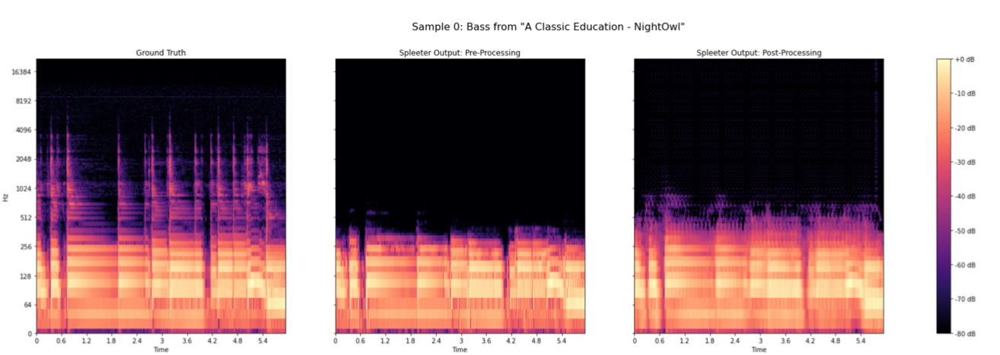
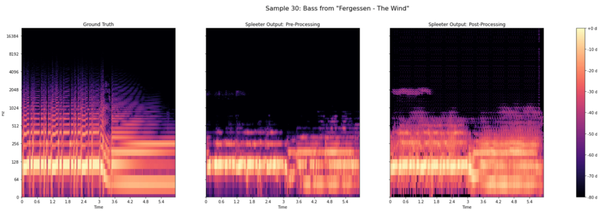

# Music Source Separation with Post Processing

Collaboration project with **Benjamin Schwartz,** *Music Information Retrieval Final Project - NYU Music Technology.*

---

A trained autoencoder to reconstruct missing information and remove artifacts in during the source separation process, using MUSDB18 and Spleeter [^1]. Acknowledgement: This concept behind this project was inspired by Make it Sound Good, a poster session at this year’s ISMIR conference out of Northwestern’s Interactive Audio Lab.1 [^2]

[^1]: Musical source separation (MSS) is an active area of research, with many open-source state-of-the-art and near state-of-the-art libraries having been released in recent years. Yet, while performance in this field has improved greatly in recent years, stems separated by even the highest quality algorithms typically still lack many of the fine details which would make them musically useful objects in their own right. Furthermore, separation models can add stereotypical artifacts depending on the underlying architecture. Therefore, the goal of this project is to train an autoencoder to learn to reconstruct some of the missing information caused by the source separation process, as well as to remove artifacts. To this end, a dataset was generated using MUSDB18 and Spleeter and an autoencoder was trained on it. While the autoencoder has not yet been trained to convergence, it shows promising signs, with the validation loss continuing to decline. Finally, an objective evaluation framework was implemented to quantitatively test our network against the unprocessed output from Spleeter using the standard Signal to Distortion, Signal to Interference and Signal to Artifact metrics.
[^2]: Cogan, B. Schaffer, N. Manilow, E., Pardo., B. (2021). MSG: Make It Sound Good
